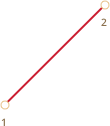
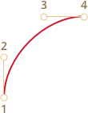
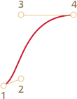
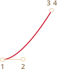
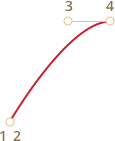
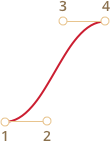
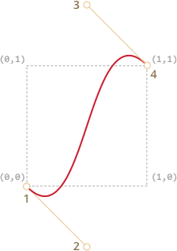

# CSS 动画

CSS 动画可以在不借助 Javascript 的情况下做出一些简单的动画效果。

<<<<<<< HEAD:3-animation/2-css-animations/article.md
你也可以通过 Javascript 控制 CSS 动画，使用少量的代码，就能让动画表现更加出色。
=======
JavaScript can be used to control CSS animation and make it even better with a little of code.
>>>>>>> 19223ae762f03cdff4e83f6f963f4f427af93847:7-animation/2-css-animations/article.md

## CSS 过渡（transition）[#css-transition]

CSS 过渡的理念非常简单，我们只需要定义某一个属性以及如何动态地表现其变化。当属性变化时，浏览器将会绘制出相应的过渡动画。

也就是说：我们只需要改变某个属性，然后所有流畅的动画都由浏览器生成。

举个例子，以下 CSS 会为 `backgroud-color` 的变化生成一个 3 秒的过渡动画：

```css
.animated {
  transition-property: background-color;
  transition-duration: 3s;
}
```

现在，只要一个元素拥有名为 `.animated` 的类，那么任何背景颜色的变化都会被渲染为 3 秒钟的动画。

单击以下按钮以演示动画：

```html run autorun height=60
<button id="color">Click me</button>

<style>
  #color {
    transition-property: background-color;
    transition-duration: 3s;
  }
</style>

<script>
  color.onclick = function() {
    this.style.backgroundColor = 'red';
  };
</script>
```

<<<<<<< HEAD:3-animation/2-css-animations/article.md
CSS 提供了五个属性来描述一个过渡：
=======
There are 4 properties to describe CSS transitions:
>>>>>>> 19223ae762f03cdff4e83f6f963f4f427af93847:7-animation/2-css-animations/article.md

- `transition-property`
- `transition-duration`
- `transition-timing-function`
- `transition-delay`

之后我们会详细介绍它们，目前我们需要知道，我们可以在 `transition` 中以 `property duration timing-function delay` 的顺序一次性定义它们，并且可以同时为多个属性设置过渡动画。

请看以下例子，点击按钮生成 `color` 和 `font-size` 的过渡动画：

```html run height=80 autorun no-beautify
<button id="growing">Click me</button>

<style>
#growing {
*!*
  transition: font-size 3s, color 2s;
*/!*
}
</style>

<script>
growing.onclick = function() {
  this.style.fontSize = '36px';
  this.style.color = 'red';
};
</script>
```

现在让我们一个一个展开看这些属性。

## transition-property

在 `transition-property` 中我们可以列举要设置动画的所有属性，如：`left、margin-left、height 和 color`。

不是所有的 CSS 属性都可以使用过渡动画，但是它们中的[大多数](http://www.w3.org/TR/css3-transitions/#animatable-properties-)都是可以的。`all` 表示应用在所有属性上。

## transition-duration

`transition-duration` 允许我们指定动画持续的时间。时间的格式参照 [CSS 时间格式](http://www.w3.org/TR/css3-values/#time)：单位为秒 `s` 或者毫秒 `ms`。

## transition-delay

`transition-delay` 允许我们设定动画**开始前**的延迟时间。例如，对于 `transition-delay: 1s`，动画将会在属性变化发生 1 秒后开始渲染。

你也可以提供一个负值。那么动画将会从整个过渡的中间时刻开始渲染。例如，对于 `transition-duration: 2s`，同时把 `delay` 设置为 `-1s`，那么这个动画将会持续 1 秒钟，并且从正中间开始渲染。

这里演示了数字从 `0` 到 `9` 的动画，使用了 CSS `translate` 方法：

[codetabs src="digits"]

如下在 `tranform` 属性上应用动画：

```css
#stripe.animate {
  transform: translate(-90%);
  transition-property: transform;
  transition-duration: 9s;
}
```

在以上的例子中，JavaScript 把 `.animate` 类添加到了元素上，由此触发了动画：

```js
stripe.classList.add('animate');
```

我们也可以『从中间』开始，也就是说从某个特定数字开始，比方说，从当前的时间的秒数开始。这就要用到负的 `transition-delay`。

此处，如果你单击这个数字，那么它会从当前的秒数开始渲染：

[codetabs src="digits-negative-delay"]

只需添加一行 JavaScript 代码：

```js
stripe.onclick = function() {
  let sec = new Date().getSeconds() % 10;
*!*
  // for instance, -3s here starts the animation from the 3rd second
  stripe.style.transitionDelay = '-' + sec + 's';
*/!*
  stripe.classList.add('animate');
};
```

## transition-timing-function

时间函数描述了动画进程在时间上的分布。它是先慢后快还是先快后慢？

乍一看，这可能是最复杂的属性了，但是稍微花点时间，你就会发现其实也很简单。

这个属性接受两种值：一个贝塞尔曲线（Bezier curve）或者阶跃函数（steps）。我们先从贝塞尔曲线开始，这也是较为常用的。

### 贝塞尔曲线（Bezier curve）

时间函数可以用[贝塞尔曲线](/bezier-curve)描述，通过设置四个满足以下条件的控制点：

1. 第一个应为：`(0,0)`。
2. 最后一个应为：`(1,1)`。
3. 对于中间值，`x` 必须位于 `0..1` 之间，`y` 可以为任意值。

CSS 中设置一贝塞尔曲线的语法为：`cubic-bezier(x2, y2, x3, y3)`。这里我们只需要设置第二个和第三个值，因为第一个点固定为 `(0,0)`，第四个点固定为 `(1,1)`。

时间函数描述了动画进行的快慢。

- `x` 轴表示时间：`0` —— 开始时刻，`1` —— `transition-duration`的结束时刻。
- `y` 轴表示过程的完成度：`0` —— 属性的起始值，`1` —— 属性的最终值。

最简单的一种情况就是动画匀速进行，可以通过设置曲线为 `cubic-bezier(0, 0, 1, 1)` 来实现。

看上去就像这样：



...正如我们所见，这就是条直线。随着时间 `x` 推移，完成度 `y` 稳步从 `0` 增长到 `1`。

例子中的列车匀速地从左侧移动到右侧：

[codetabs src="train-linear"]

这个里面的 CSS 就是基于刚才那条曲线的：

```css
.train {
  left: 0;
  transition: left 5s cubic-bezier(0, 0, 1, 1);
  /* JavaScript sets left to 450px */
}
```

...那么，我们如果表现出减速行驶的列车呢？

我们可以使用另一条贝塞尔曲线：`cubic-bezier(0.0, 0.5, 0.5 ,1.0)`。

图像如下：



正如我们所见，这个过程起初很快：曲线开始迅速升高，然后越来越慢。

这是实际的效果演示：

[codetabs src="train"]

CSS：
```css
.train {
  left: 0;
  transition: left 5s cubic-bezier(0, .5, .5, 1);
  /* JavaScript sets left to 450px */
}
```

CSS 提供几条内置的曲线：`linear`、`ease`、`ease-in`、`ease-out` 和 `ease-in-out`。

`linear` 其实就是 `cubic-bezier(0, 0, 1, 1)` 的简写 —— 一条直线，刚刚我们已经看过了。 

其它的名称是以下贝塞尔曲线的简写：

| <code>ease</code><sup>*</sup> | <code>ease-in</code> | <code>ease-out</code> | <code>ease-in-out</code> |
|-------------------------------|----------------------|-----------------------|--------------------------|
| <code>(0.25, 0.1, 0.25, 1.0)</code> | <code>(0.42, 0, 1.0, 1.0)</code> | <code>(0, 0, 0.58, 1.0)</code> | <code>(0.42, 0, 0.58, 1.0)</code> |
|  |  |  |  |

`*` —— 默认值，如果没有指定时间函数，那么将使用 `ease` 作为默认值。

所以，我们可以使用 `ease-out` 来表现减速行驶的列车：


```css
.train {
  left: 0;
  transition: left 5s ease-out;
  /* transition: left 5s cubic-bezier(0, .5, .5, 1); */
}
```

但是这看起来有点怪怪的。

**贝塞尔曲线可以使动画『超出』其原本的范围。**

曲线上的控制点的 `y` 值可以使任意的：不管是负值还是一个很大的值。如此，贝塞尔曲线就会变得很低或者很高，让动画超出其正常的范围。

在一下的例子中使用的代码：
```css
.train {
  left: 100px;
  transition: left 5s cubic-bezier(.5, -1, .5, 2);
  /* JavaScript sets left to 400px */
}
```

`left` 本该在 `100px` 到 `400px` 之间变化。

但是如果你点击列车，你会发现：

- 起初，列车会**反向**运动：`left` 会变得小于 `100px`。
- 然后，它会变回往前运动，并且超过 `400px`。
- 最后再返回 —— 回到 `400px`。

[codetabs src="train-over"]

为什么会这样？看一眼给定的贝塞尔曲线的图像你就会明白了。



我们把第二个点的 `y` 坐标移动到了小于 `0` 的位置，同时把第三个点的 `y` 坐标移动到了大于 `1` 的位置，因此曲线已经不再像一个四分之一圆了。`y` 坐标超出了常规的 `0..1` 的范围。

正如我们所知，`y` 表示『动画进程的完成度』。`y = 0` 表示属性的初始值，`y = 1` 则表示属性的最终值。因此，`y < 0` 意味着属性值要比初始值小，而 `y > 1` 则表明属性值要比最终值大。

当然了，`-1` 和 `2` 还是比较缓和的值。如果我们把 `y` 设为 `-99` 和 `99`，那么列车将会偏离地更远。

但是，如何针对特定的任务寻找到合适的贝塞尔曲线呢？事实上，有很多工具可以帮到你。比方说，我们可以利用这个网站：<http://cubic-bezier.com/>。

### 阶跃函数（Steps）

时间函数 `steps(number of steps[, start/end])` 允许你让动画分段进行，`number of steps` 表示需要拆分为多少段。

<<<<<<< HEAD:3-animation/2-css-animations/article.md
让我们通过一个数字的例子来演示一下。我们将会让数字以离散的方式变化，而不是以连续的方式。

为了达到效果，我们把动画拆分为 9 段：
=======
Let's see that in an example with digits.

Here's a list of digits, without any animations, just as a source:

[codetabs src="step-list"]

We'll make the digits appear in a discrete way by making the part of the list outside of the red "window" invisible and shifting the list to the left with each step.

There will be 9 steps, a step-move for each digit:
>>>>>>> 19223ae762f03cdff4e83f6f963f4f427af93847:7-animation/2-css-animations/article.md

```css
#stripe.animate  {
  transform: translate(-90%);
  transition: transform 9s *!*steps(9, start)*/!*;
}
```

<<<<<<< HEAD:3-animation/2-css-animations/article.md
`step(9, start)` 生效时：

[codetabs src="step"]

`steps` 的第一个参数表示段数。这个过渡动画将会被拆分为 9 个部分（每个占 10%）。时间间隔也会以同样的方式被拆分：9 秒会被分割为多个时长 1 秒的间隔。
=======
In action:

[codetabs src="step"]

The first argument of `steps(9, start)` is the number of steps. The transform will be split into 9 parts (10% each). The time interval is automatically divided into 9 parts as well, so `transition: 9s` gives us 9 seconds for the whole animation – 1 second per digit.
>>>>>>> 19223ae762f03cdff4e83f6f963f4f427af93847:7-animation/2-css-animations/article.md

第二个参数可以取 `start` 或 `end` 两者其一。

`start` 表示在动画开始时，我们需要立即开始第一段的动画。

可以观察到，在动画过程中：当我们单击数字之后，它会立马变为 `1`（即第一段），然后在下一秒开始的时候继续变化。

具体的流程如下：

- `0s` —— `-10%`（在第一秒开始的时候立即变化）
- `1s` —— `-20%`
- ...
- `8s` -- `-80%`
- （最后一秒，显示最终值）

另一个值 `end` 表示：改变不应该在最开始的时候发生，而是发生在每一段的最后时刻。

其流程如下：

- `0s` —— `0`
- `1s` —— `-10%`（在第一秒结束时第一次变化）
- `2s` —— `-20%`
- ...
- `9s` —— `-90%`

<<<<<<< HEAD:3-animation/2-css-animations/article.md
`step(9, end)` 生效时：
=======
Here's `step(9, end)` in action (note the pause between the first digit change):
>>>>>>> 19223ae762f03cdff4e83f6f963f4f427af93847:7-animation/2-css-animations/article.md

[codetabs src="step-end"]

另外还有一些简写值：

- `step-start` —— 等同于 `steps(1, start)`。即：动画立刻开始，并且只有一段。也就是说，会立刻开始，紧接着就结束了，宛如没有动画一样。
- `step-end` —— 等同于 `steps(1, end)`。即：在 `transition-duration` 结束时生成一段动画。

这些值很少会被用到，因为它们并不算是真正的动画，而是单步的变化。

## transitionend 事件

CSS 动画完成后，会触发 `transitionend` 事件。

这被广泛用于在动画结束后执行某种操作。我们也可以用它来串联动画。

举例来说，下面的小船会在点击后向右浮动，然后再回来。而且，每一次都会向右移动地更远一点：

[iframe src="boat" height=300 edit link]

这个动画通过 `go` 函数初始化，并且在每次动画完成后都会重复执行，并转变方向：

```js
boat.onclick = function() {
  //...
  let times = 1;

  function go() {
    if (times % 2) {
      // 向右移动
      boat.classList.remove('back');
      boat.style.marginLeft = 100 * times + 200 + 'px';
    } else {
      // 向左移动
      boat.classList.add('back');
      boat.style.marginLeft = 100 * times - 200 + 'px';
    }

  }

  go();

  boat.addEventListener('transitionend', function() {
    times++;
    go();
  });
};
```

`transitionend` 的事件对象有几个特定的属性：

`event.propertyName`
：当前完成动画的属性，这在我们同时为多个属性加上动画时会很有用。

`event.elapsedTime`
：动画完成的时间（按秒计算），不包括 `transition-delay`。

## 关键帧动画（Keyframes）

我们可以通过 CSS 提供的 `@keyframes` 规则整合多个简单的动画。

它会指定某个动画的名称以及相应的规则：哪个属性，何时以及何地渲染动画。然后使用 `animation` 属性把动画绑定到相应的元素上，并为其添加额外的参数。

这里有个详细的例子：

```html run height=60 autorun="no-epub" no-beautify
<div class="progress"></div>

<style>
*!*
  @keyframes go-left-right {        /* 指定一个名字："go-left-right" */
    from { left: 0px; }             /* 从 left: 0px 开始 */
    to { left: calc(100% - 50px); } /* 移动至 left: 100%-50px */
  }
*/!*

  .progress {
*!*
    animation: go-left-right 3s infinite alternate;
    /* 把动画 "go-left-right" 应用到元素上
       持续 3 秒
       持续次数：infinite
       每次都改变方向
    */
*/!*

    position: relative;
    border: 2px solid green;
    width: 50px;
    height: 20px;
    background: lime;
  }
</style>
```

有许多关于 `@keyframes` 的文章以及一个[详细的规范说明](https://drafts.csswg.org/css-animations/)。

很可能你并不需要经常用到 `@keyframes`，除非你的网站上有一直在运动的元素。

## 总结

CSS 动画允许你为一个或者多个属性的变化创建丝滑流畅（也可能不是）的过渡动画。

它们适用于大多数的动画需求。我们也可以使用 JavaScript 创建动画，下一章将会详细讲解相关内容。

相对于 JavaScript 动画，CSS 动画存在的特点如下：

```compare plus="CSS animations" minus="JavaScript animations"
+ 简单的事，简单地做。
+ 快速，而且对 CPU 造成的压力很小。
- JavaScript 动画更加灵活。它们可以实现任何动画逻辑，比如某个元素的爆炸效果。
- 不仅仅只是属性的变化。我们还可以在 JavaScript 中生成新元素用于动画。
```

本节已经介绍了可以使用 CSS 实现的主要动画类型，而且 `transitionend` 还允许在动画结束后执行 JavaScript 代码，因此它可以方便得与代码结合起来。

但是在下一节，我们将会学习一些 JavaScript 动画来实现更加复杂的效果。
